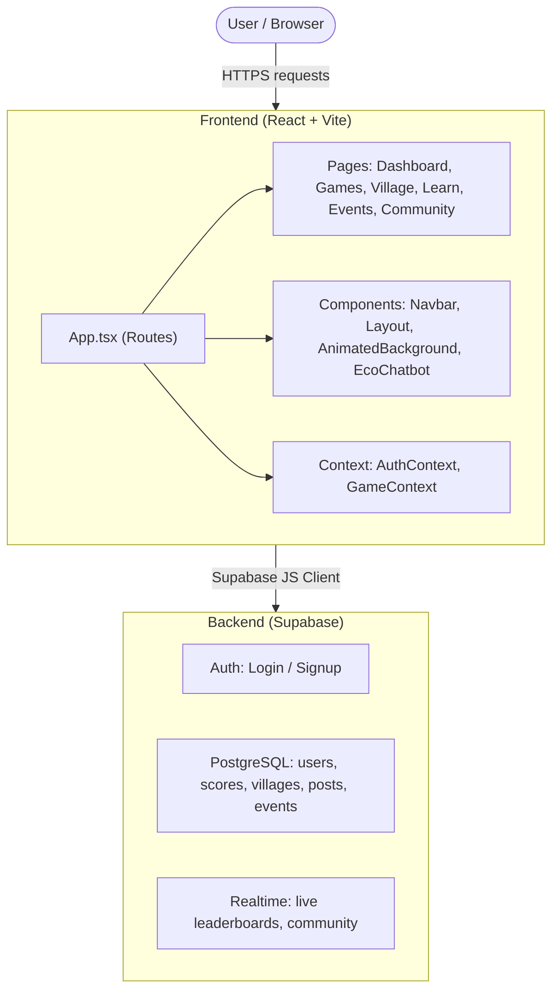

# EcoPlay - Architecture Overview

A quick guide to help new contributors understand how EcoPlay's components fit together.

## Tech Stack

| Layer | Technology |
|---|---|
| Framework | React 18 + TypeScript |
| Build Tool | Vite 5+ |
| Styling | Tailwind CSS 3+ |
| Routing | React Router DOM v7 |
| Animations | Framer Motion |
| Backend / Database | Supabase (PostgreSQL) |
| Icons | Lucide React |

## System Diagram



## Project Structure

```
ecoplay/
├── public/                  # Static assets
├── docs/
│   └── ARCHITECTURE.md      # This file
├── src/
│   ├── components/          # Reusable UI components
│   ├── context/             # Global state via React Context
│   ├── lib/                 # Supabase client setup
│   ├── pages/               # One file per route
│   ├── services/            # Utility services
│   ├── App.tsx              # Root component and routes
│   ├── ErrorBoundary.tsx    # Top-level error handling
│   ├── main.tsx             # App entry point
│   └── index.css            # Global styles
├── .env.example
├── vite.config.ts
└── tailwind.config.js
```

## src/components/

| File | Purpose |
|---|---|
| AnimatedBackground.tsx | Parallax animated background |
| EcoChatbot.tsx | AI environmental assistant chatbot |
| Layout.tsx | Page wrapper with Navbar |
| Navbar.tsx | Top navigation bar |

## src/pages/

| File | Purpose |
|---|---|
| Auth.tsx | Authentication entry point |
| Login.tsx | Login and signup forms |
| Dashboard.tsx | User dashboard - points, levels, badges |
| Learn.tsx | Educational content and tutorials |
| Community.tsx | Community feed and discussions |
| Events.tsx | Environmental events listing |
| EcoVillage.tsx | Interactive eco village |
| Bingo.tsx | Eco-challenge bingo game |
| OceanCleanupGame.tsx | Ocean trash collection mini-game |

## src/context/

| File | Purpose |
|---|---|
| AuthContext.tsx | User auth state, login and logout |
| GameContext.tsx | Game progress and scores |

## src/lib/

| File | Purpose |
|---|---|
| supabase.ts | Supabase client initialisation |

## src/services/

| File | Purpose |
|---|---|
| persistence.ts | Save and load persistent game state |

## Environment Variables

Copy `.env.example` to `.env` and fill in:

```
VITE_SUPABASE_URL=https://your-project.supabase.co
VITE_SUPABASE_ANON_KEY=your-anon-key
```

For full setup instructions, see the [README](../README.md).
